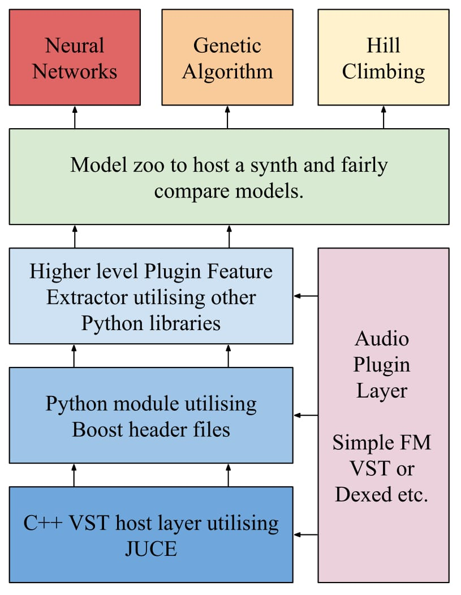

## Deep Learning and Software Synthesisers
##### Artificial Assistants That Program Synthesisers

---

## Motivations
 
- AI that makes VSTs produce a desired sound |
- Enables the user to focus on music |

---

## Objectives
 
- Hacking with VSTs hosted in Python |
- Can neural networks can learn to program synthesisers? |
- Compare neural networks against other optimisation techniques |

---

## Methodologies
 

---

## Results
 
---

## Evaluations
 
---

## Future
 
