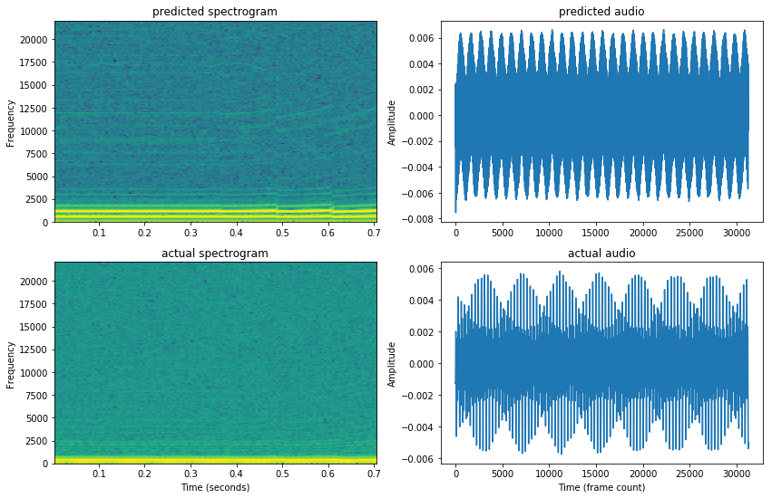
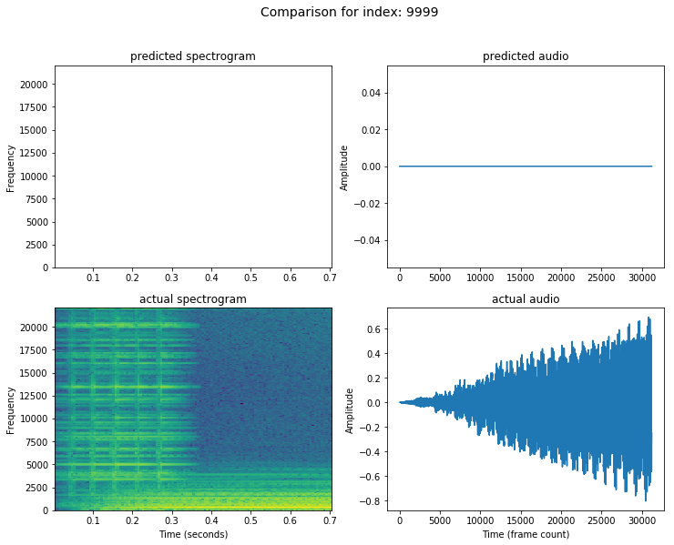

## Deep Learning and Software Synthesisers
##### Artificial Assistants That Program Synthesisers

---

## Motivations
 
- AI that makes VSTs produce a desired sound |
- Enables the user to focus on music |

---

## Objectives
 
- Hacking with VSTs hosted in Python |
- Can neural networks can learn to program synthesisers? |
- Compare neural networks against other optimisation techniques |

---

## Host VST in Python
 
- C++ JUCE Library hosts VST |
- Boost Python headers expose VST Host class to Python |
- Create better VST host in Python using exposed class |

---

## Use Python VST host
 
- Create whopping datasets |
- Biggest dataset had 1,771,561 examples |
- Each example is a pair of features and parameters |
- Tell the VST host which audio features you want |
- Parameters are the settings used to make the features |

---

## TensorFlow
 
- Split the datasets into Testing, Training, Validation |
- Create a network graph |
- Train the network|

---

## Visualising the results
 
- Save testing predictions in a datastructure |
- Sort by feature distance |
- MatPlotLib and Pandas for visualisation |

---

## Experiments
 
- Experimented with synthesisers |
- Experimented with features |
- Experimented with optimisation techniques |
- Experimented with reinforcement learning |
---

## Granulator Synth (6 Parameters)
 

<audio controls>
    <source src="http://doc.gold.ac.uk/~lfedd001/audio/actual_gran.wav"/>
</audio>
<audio controls>
    <source src="http://doc.gold.ac.uk/~lfedd001/audio/predicted_gran.wav"/>
</audio>
---

## FM (6 Parameters)
 

<audio controls>
    <source src="http://doc.gold.ac.uk/~lfedd001/audio/actual_fm.wav"/>
</audio>
<audio controls>
    <source src="http://doc.gold.ac.uk/~lfedd001/audio/predicted_fm.wav"/>
</audio>
---

## LSTM One Operator Dexed (23 Parameters)
 

<audio controls>
    <source src="http://doc.gold.ac.uk/~lfedd001/audio/actual_dexed_one.wav"/>
</audio>
<audio controls>
    <source src="http://doc.gold.ac.uk/~lfedd001/audio/predicted_dexed_one.wav"/>
</audio>
---

## MLP Five Operator Dexed (115 Parameters)
 

<audio controls>
    <source src="http://doc.gold.ac.uk/~lfedd001/audio/actual_dexed_five.wav"/>
</audio>
<audio controls>
    <source src="http://doc.gold.ac.uk/~lfedd001/audio/predicted_dexed_five.wav"/>
</audio>
---

## Not So Good: Granulator (6 Parameters)
 

<audio controls>
    <source src="http://doc.gold.ac.uk/~lfedd001/audio/actual_bad_gran.wav"/>
</audio>
<audio controls>
    <source src="http://doc.gold.ac.uk/~lfedd001/audio/predicted_bad_gran.wav"/>
</audio>
---

## Not So Good: FM (6 Parameters)
 

<audio controls>
    <source src="http://doc.gold.ac.uk/~lfedd001/audio/actual_bad_fm.wav"/>
</audio>
<audio controls>
    <source src="http://doc.gold.ac.uk/~lfedd001/audio/predicted_bad_fm.wav"/>
</audio>
---

## Future
 
- Modelling synthesisers is better than searching for solutions
- Feature distance trumps parameter distance
- Reinforcement / Evolution Strategies?
- Importance of the correct features - learn from audio?
- One model to rule them all - transfer learning?
